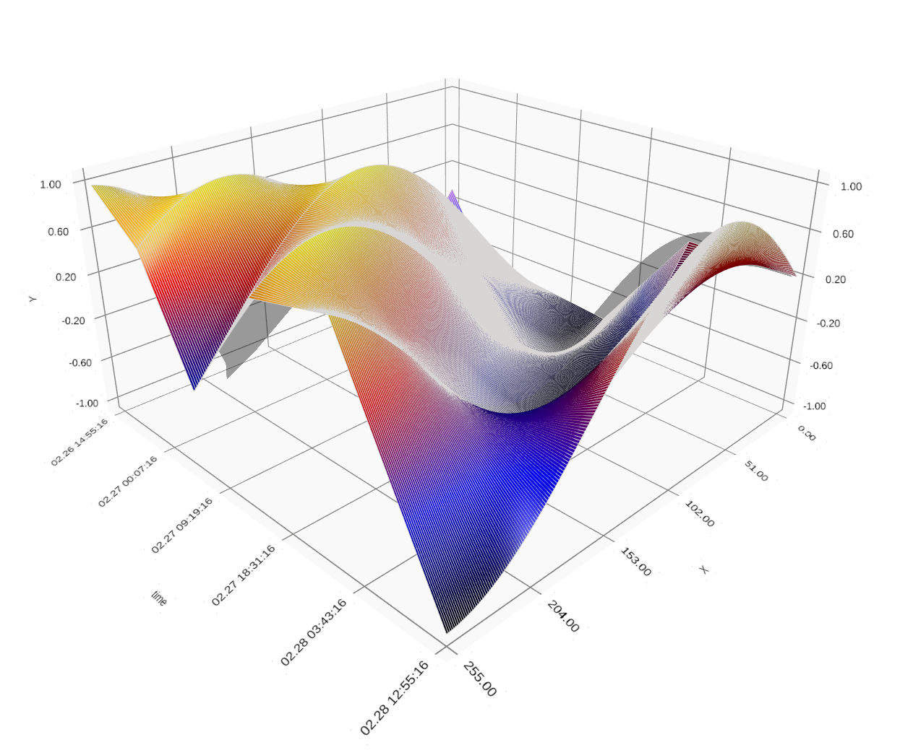

# Time array 3D plot plugin

The *qutimearray3dplotplugin* employs the QtDataVisualization module to provide a means to display
arrays of data over time. The time scale is on the Z axis.

## Requirements

- [QtDataVisualization module](https://doc.qt.io/qt-5/qtdatavisualization.html)
- [cumbia-libs](https://github.com/ELETTRA-SincrotroneTrieste/cumbia-libs)

## Installation

- qmake
- make 
- make install

### qmake options

A path different from the default */usr/local/cumbia-libs* can be specified with the INSTALL_ROOT option.
It points to where cumbia-libs are currently installed:

- qmake INSTALL_ROOT=/path/to/cumbia-libs

